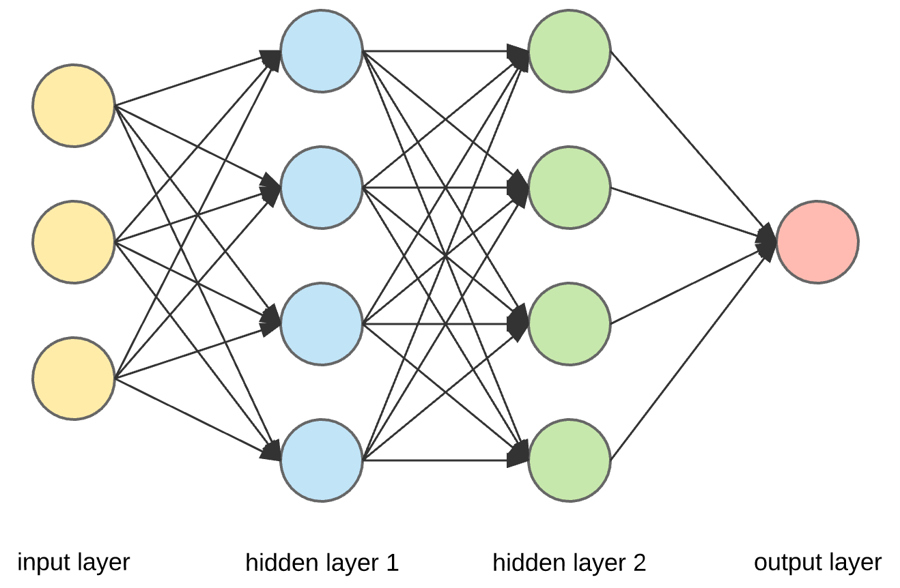

# Rust DNN

Create Modular Lightweight Deep Neural Networks in Rust easy

# Progress

Very basic layers have been implemented. Ill make more if people star the project

# Installation

After running

```
cargo add Rust_Simple_DNN
```

Then you must put these in your rust code

```rust
use Rust_Simple_DNN::rdnn::layers::*;
use Rust_Simple_DNN::rdnn::*;
```

# Current Implemented Layers

Think of layers as building blocks for a neural network. Different Layers process data in different ways. Layers can be trained.
### layers:

- Fully connected Dense Layers

```rust
FC::new(inputSize, outputSize)
```

These are best when doing just straight raw brain processing. Using these combined with activations, it is technically possible to make a mathematical ai for anything.
These layers have exponintial more computation when scaled up though.

<br>

- Activations

```rust
Tanh::new(inputSize); //hyperbolic tangent
Relu::new(inputSize); //if activation > 0
Sig::new(inputSize); //sigmoid
```

Put these after FC,Conv,Deconv, or any dotproduct type layer to make the network nonlinear, or else the network will not work 99% of use cases.

# starting tutorial

This is how you make a neural network that looks like this
<br>


Use this code to make it:

```rust

//Model/network/AI Definition
let mut net = Net::new(
        vec![
            FC::new(3, 4), //Linear/Dense input size 3, output 4
            Sig::new(4), //sigmoid, input 4 output 4

            FC::new(4, 4),
            Sig::new(4), //sigmoid

            FC::new(4, 1),// input 4 output 1
            Sig::new(1), //sigmoid
        ],
        1, //batch size
        0.1, //learning rate
    );
```

<br>
<br>
This is how you *propagate data* through the network:

```rust
net.forward_data(&vec![1.0, 0.0, -69.0]); //returns the output vector from the Model
```

After propagating data through, you can then backpropagate your target:

```rust
// This parameter is the models target, (aka what you want the ai to output)
 net.backward_data(&vec![0.0]); //trains the ai to output 0
```

The network will store and apply the gradients, so to train the network, all you need to do is repeatedly forward and back-propagate your data in order

```rust
//TRAINING LOOP

let mut iteration = 0; //just a counter
    while iteration < 5000 {
        net.forward_data(&vec![1.0, 0.0, 0.0]);
        net.backward_data(&vec![1.0]);

        net.forward_data(&vec![1.0, 1.0, 0.0]);
        net.backward_data(&vec![0.0]);

        net.forward_data(&vec![0.0, 1.0, 0.0]);
        net.backward_data(&vec![1.0]);

        net.forward_data(&vec![0.0, 0.0, 0.0]);
        net.backward_data(&vec![0.0]);
        iteration += 1;
    }

//at this point its well trained
```
